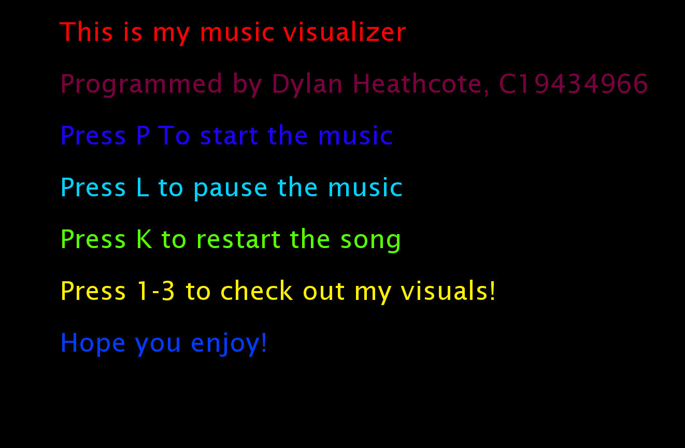
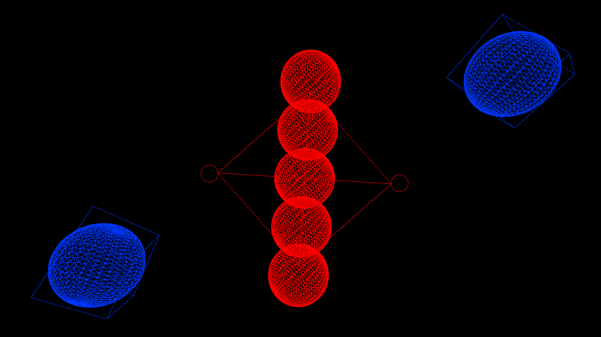
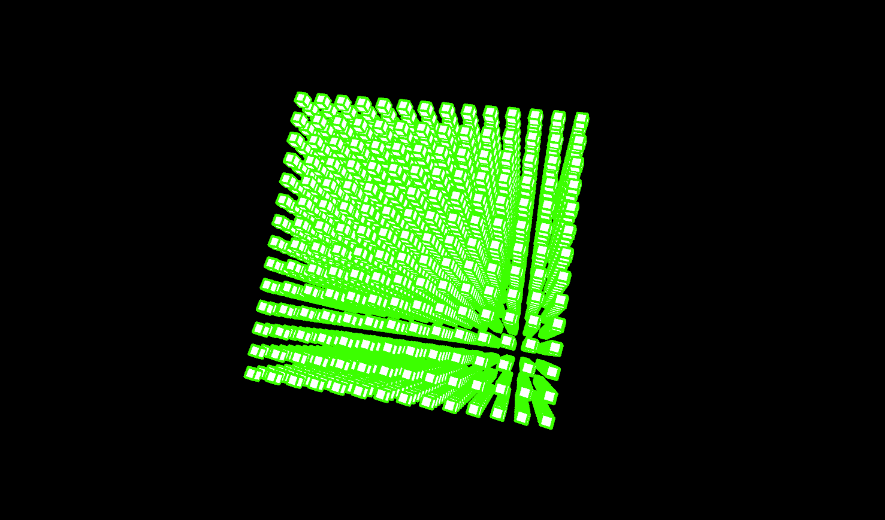
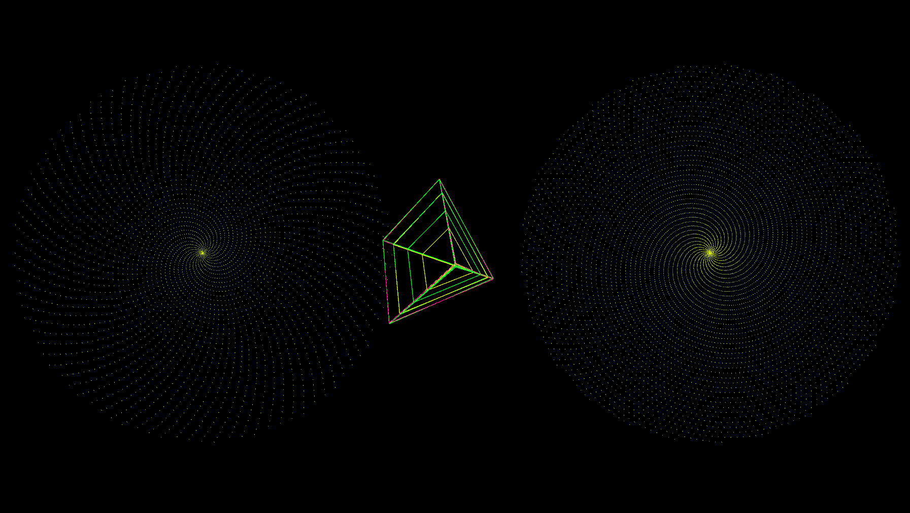

# Music Visualiser Project

Name:Dylan Heathcote

Student Number: C19434966

# Description of the assignment
This is "Something beautiful to enjoy while listening to music". I have created a visualization that users can interact with and flick through each visual at different parts of the song as they please. I have chosen a slow starting song but when it gets going it makes you zone out with everything thats going on. My visusuals react based on the amplitude and frequency of the song that is playing.

# Instructions
- You start playing the music by pressing "P".
- There is 3 visuals so you can click 1-3 for each visual and press 0 to return to the menu.
- You can pause the song by pressing "L", and you can restart the song by pressing "K" also.

# How it works
The MyVisuals.java file is the main file that runs everything on the program. 
When you press F5 to run, it automatically sets the Menu.java file to true so that the first thing you see is the menu. It loads the audio file with loadAudio("");. We also set the colorMode to HSB and the framerate to 60. We also calculate the average amplitude in the draw function so that the other files can take the amplitude to work with the visuals.


 - Every class has a constructor which initializes every object. This will let us access all of the variables from the MyVisuals file. 

```Java
	public class MyVisuals extends Visual {

    boolean cube = false;
    boolean turning = false;
    boolean menu = true;
    boolean pyramids = false;

    CubesVisual cv;
    TurningCube tc;
    Menu mm;
    Pyramids pp;
```

# What I am most proud of in the assignment
I am most proud of my second visual of the rotating and turning rubix cube of cubes. When I first set out to think of an idea I never thought I would have came to do that. I done some browsing online of some cool shapes and designs in processing and came across a forum talking about a rubix cube then I thought what if I make a rubix cube of smaller cubes isntead of just 1 big huge cube. I thought it would have been endless amounts of code to get what I was going for but it turned out to be a lot shorter and easier then expected! It did take me a while to get it working how I wanted it to work, but I got there in the end.

```Java
tc.background(0);
        tc.translate(tc.width/2f, tc.height/2f); 
        tc.rotateX(angle); 
        tc.rotateY(angle); 
        tc.rotateZ(angle);
        
        for (int xo = -OFF_MAX; xo <= OFF_MAX; xo += 30) {  
          for (int yo = -OFF_MAX; yo <= OFF_MAX; yo += 30) {
            for (int zo = -OFF_MAX; zo <= OFF_MAX; zo += 30) {
              tc.pushMatrix();
              tc.translate(xo, yo, zo); 
              tc.rotateX(angle);
              tc.rotateY(angle);
              tc.rotateZ(angle);
              tc.stroke(PApplet.map(tc.getAmplitude()*2, 0, 1, 0,255), 255, 255); 
              tc.strokeWeight(4); 
              tc.fill(0, 0, 255); 
              tc.box((float) (15 + (Math.sin(angle1)) * 10)); 
              tc.popMatrix();
            }
            angle += 0.00005f; 
            angle1 += 0.00005f;
```

# Pictures of other visuals
- Menu Visual


- Visual 1 Spheres, Circles, boxes.



- Visual 2 Rubix cubes of smaller cubes.



- Visual 3 2 Spirals with pyramids with smaller pyramids inside it.


# Youtube video

This is my youtube video : [](https://youtu.be/eykQeFSJ6yc)